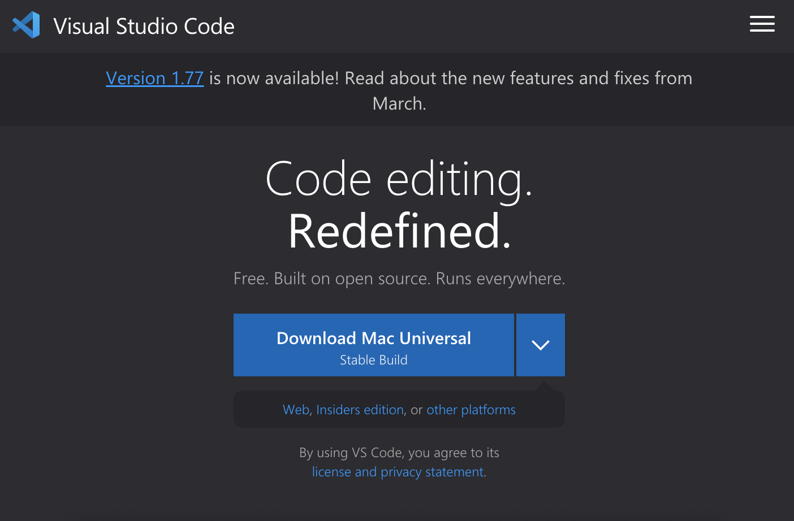
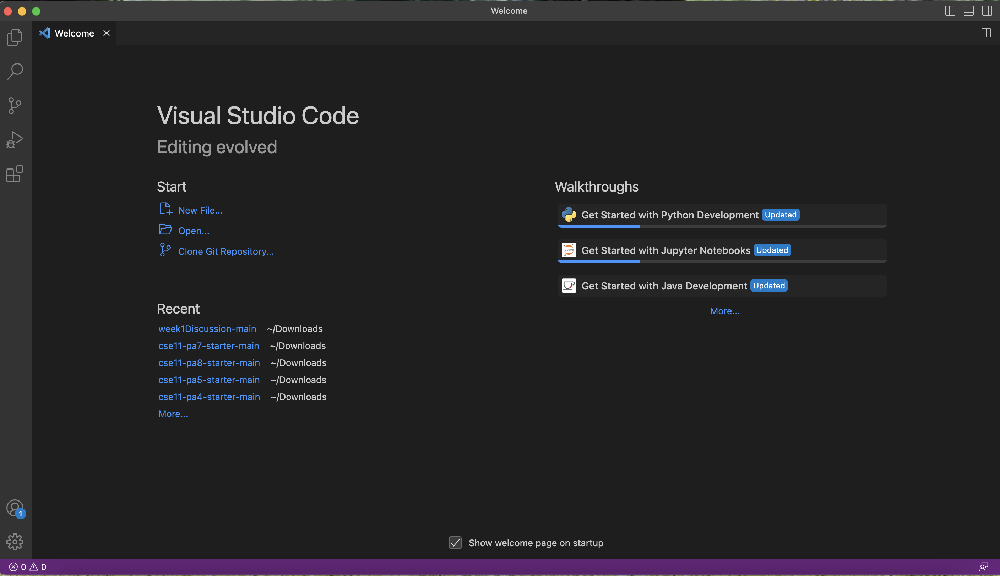
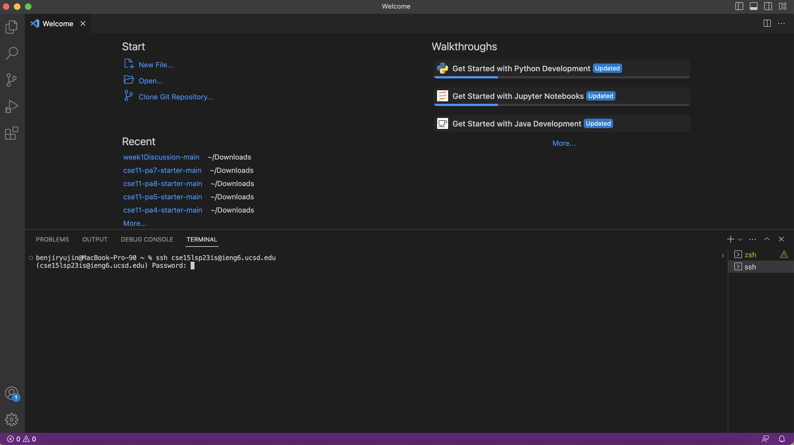
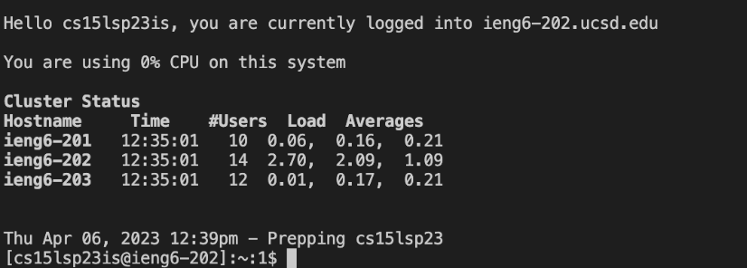
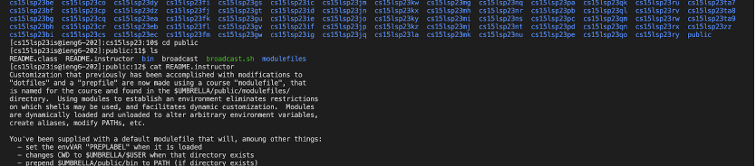

**Lab Report Week 1**

**Installing VScode**

To install VScode, first go to any browser and search for "visual studio code" in your preferred browser. Follow the first link on the page, which should 
lead you to [VSCode download page](https://code.visualstudio.com/). The website should look like this.

From here, you can download VScode regardless of your operating system, as long as you select the appropriate option. Follow the installation process
that the application provides and open up VScode! If properly downloaded, it should look something like this. 

**Remotely connecting**

Once VScode is opened, open the terminal by selecting the option or by using holding down CTRL on your keyboard and pressing the "`" key. The terminal should appear on the bottom half of VScode application. Then, type in (`ssh cs15lsp23zz@ieng6.ucsd.edu) in the terminal, replacing the "zz" in the email with that which appears in your course-specific account. To find this account, go to [UCSD Account Lookup](https://sdacs.ucsd.edu/~icc/index.php) to find your account. After the 
command is typed in the terminal, click ENTER on your keyboard and you will be prompted with a password. Please type in your corresponding password
in the command line. (Note: for privacy protection, you will not be able to see your password as you are typing it). 

If instead of prompting a password, the terminal states something like 

"The authenticity of host 'ieng6.ucsd.edu (128.54.70.227)' can't be established.
RSA key fingerprint is SHA256:ksruYwhnYH+sySHnHAtLUHngrPEyZTDl/1x99wUQcec.
Are you sure you want to continue connecting (yes/no/[fingerprint])? "

Then it would be your first time connecting to the server! If it is indeed your first time, you can type "yes" and you will then be prompted with a password to enter.

Once your password is successfully entered, your terminal should output some messages like this:

**Trying Some Commands**

After successfully connecting to the server remotely, try testing various commands to see their effect and whether they work or not. These commands include (`cd), (`ls), (`cp), and (`cat), which are various terminal commands that help you find certain files or folders in directories stored in the computer. The different functions of popular terminal commands such as those listed above can be found on the website: [Popular terminal commands] (https://towardsdatascience.com/17-terminal-commands-every-programmer-should-know-4fc4f4a5e20e). 

An example of various commands can be seen in the image below.

In blue is all of the various student accounts held in the cs15sp23l directory on the remote computer. (`cd public) leads us to change our directory to the "public" directory, which has files that can be seen with (`ls). The (`cat) command allows us to view the contents of specific files, in which we test out with (`cat README.instructor), which carries the text in the image. 

To log out of the remote server, you can either type "exit" into your terminal or use the command "CTRL + D" on your keyboard.

